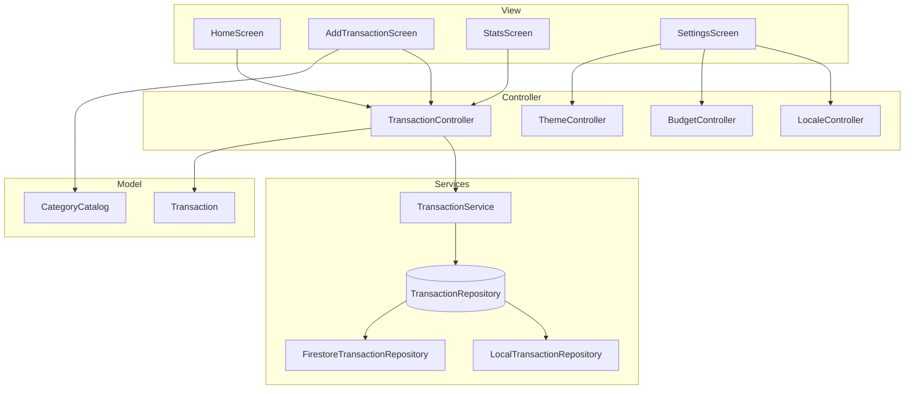

# Architecture — Expense Manager

## Vue d’ensemble (MVC + Provider)

## Rôles des couches

| Couche | Dossier | Responsabilité |
|--------|---------|----------------|
| **Model** | `lib/models/` | Structures de données, sérialisation JSON |
| **View** | `lib/views/` | Interface utilisateur uniquement (pas de logique métier) |
| **Controller** | `lib/controllers/` | État applicatif, règles métier, notifications UI via `ChangeNotifier` |
| **Services** | `lib/services/` | Accès données (local / API Firestore), gestion chargement & erreurs |

## Flux CRUD

1. L’utilisateur remplit le formulaire (`AddTransactionScreen`).
2. Le **Controller** valide et appelle `TransactionService`.
3. Le **Service** délègue au **Repository** (Firestore ou SharedPreferences).
4. Le stream Firestore ou un `refresh()` local met à jour la liste.
5. La **View** se reconstruit via `Consumer<TransactionController>`.

## Gestion d’état (Provider)

- `MultiProvider` dans `main.dart` enregistre tous les controllers.
- Un controller = un domaine fonctionnel (transactions, locale, budget, thème).
- Les vues utilisent `context.watch` / `Consumer` pour l’affichage réactif.

## Persistance

| Mode | Implémentation | Déclencheur |
|------|----------------|-------------|
| Cloud | `FirestoreTransactionRepository` | Firebase initialisé + auth anonyme |
| Local | `LocalTransactionRepository` | Échec ou absence de Firebase |

## Internationalisation

- Clés de catégories stables (`food`, `salary`, …) stockées en base.
- Libellés affichés via `AppLocalizations.categoryLabel(key)`.
- `LocaleController` persiste le choix FR/EN.

## Bonnes pratiques appliquées

- Séparation stricte View / Controller / Service
- Widgets réutilisables (`SummaryCard`, `CategoryChart`, …)
- États de chargement et bannière d’erreur avec retry
- Commentaires de module pour le travail en équipe
